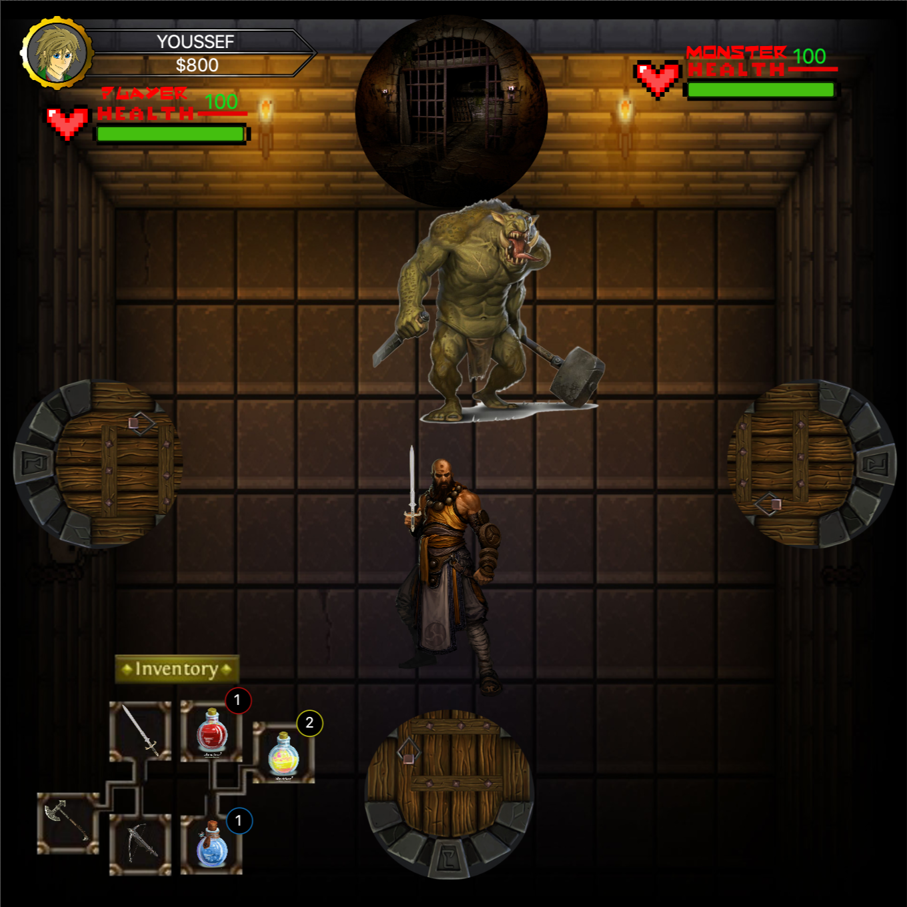
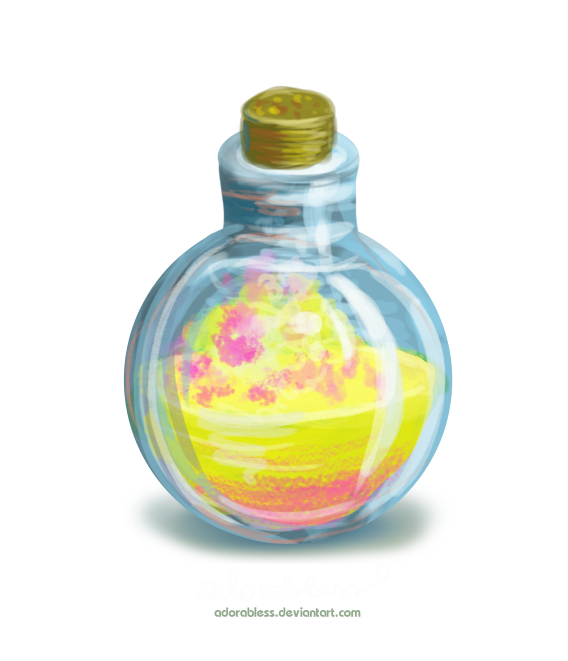
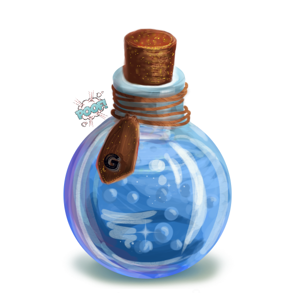
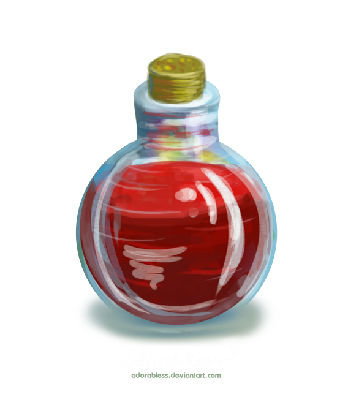
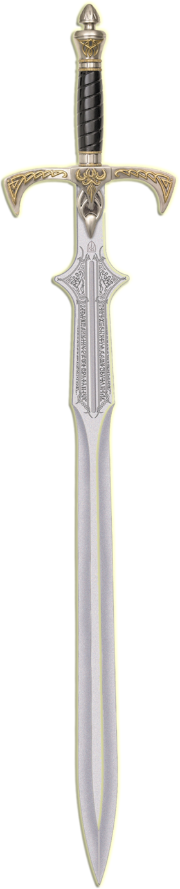
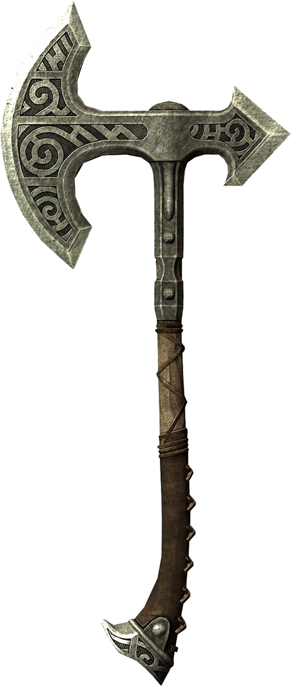
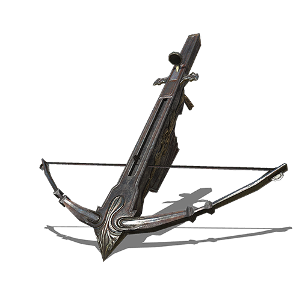
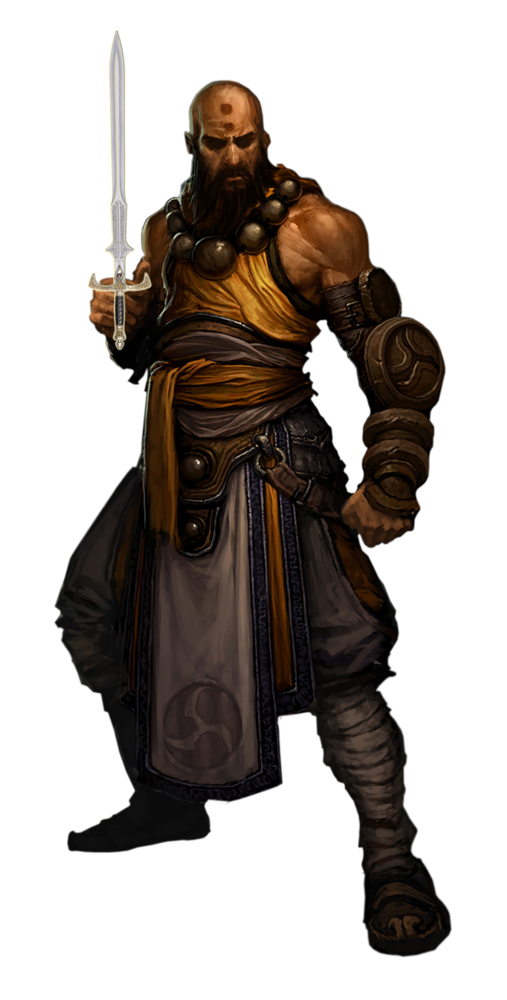
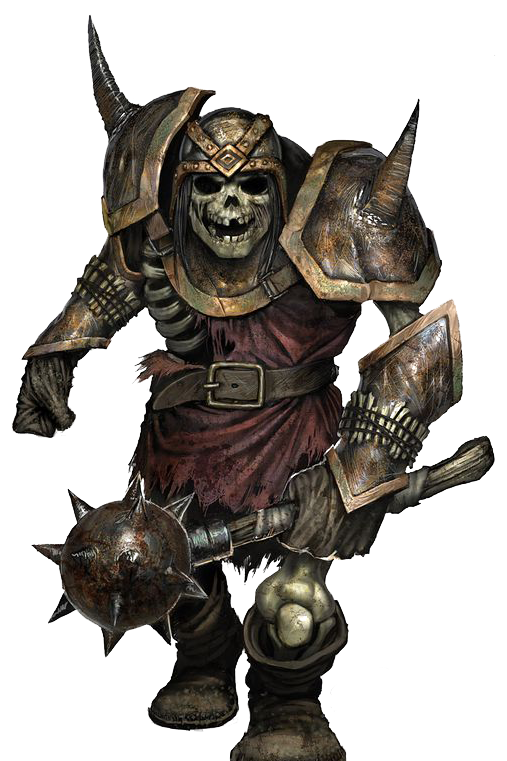
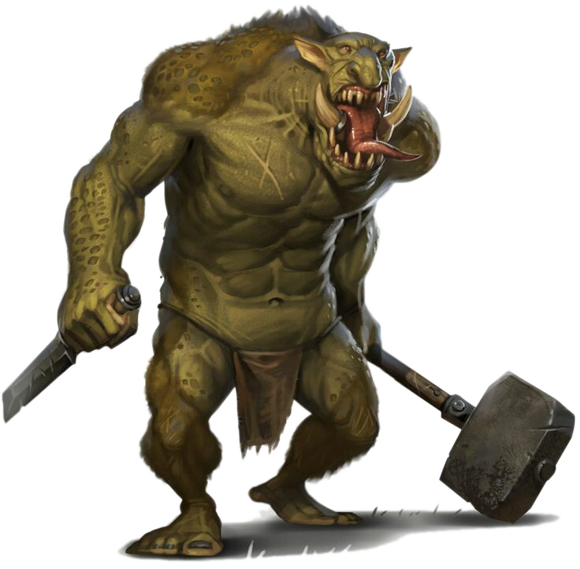

# Dungeon Crawler Game

Crawl through a dynamic dungeon!

As you progress through the dungeon, encounter random monsters and chests to advance towards the Final Boss room to escape the dungeon. 
You may find potions and weapons during the journey, they will always help you! 
If you reach the final room, battle the Minotaur to escape the dungeon alive! Otherwise, you'll be stuck in the dungeon forever.

## Game Items

<table>
  <tr>
    <td>Accuracy Potion</td>
     <td>Attack Potion</td>
     <td>Health Potion</td>
     <td>Sword</td>
     <td>Axe</td>
     <td>Bow</td>
  </tr>
  <tr>
    <td valign="top"></td>
    <td valign="top"></td>
    <td valign="top"></td>
    <td valign="top"></td>
    <td valign="top"></td>
    <td valign="top"></td>
  </tr>
 </table>
 
 
## Game Players and Monsters

<table>
  <tr>
    <td>Player</td>
     <td>Monster - Skeleton</td>
     <td>Monster - Spider</td>
     <td>Monster - Minotaur</td>
  </tr>
  <tr>
    <td valign="center"></td>
    <td valign="center"></td>
    <td valign="center"></td>
    <td valign="center"></td>
  </tr>
 </table>
 
## Game Controls

<table>
  <tr>
    <td>Attack Monster</td>
     <td>Add to Inventory</td>
     <td>Equip</td>
     <td>Discard</td>
     <td>Begin Challenge</td>
     <td>Health HP</td>
  </tr>
  <tr>
    <td valign="center"></td>
    <td valign="center"></td>
    <td valign="center"></td>
    <td valign="center"></td>
    <td valign="center"></td>
    <td valign="center"></td>
  </tr>
 </table>
